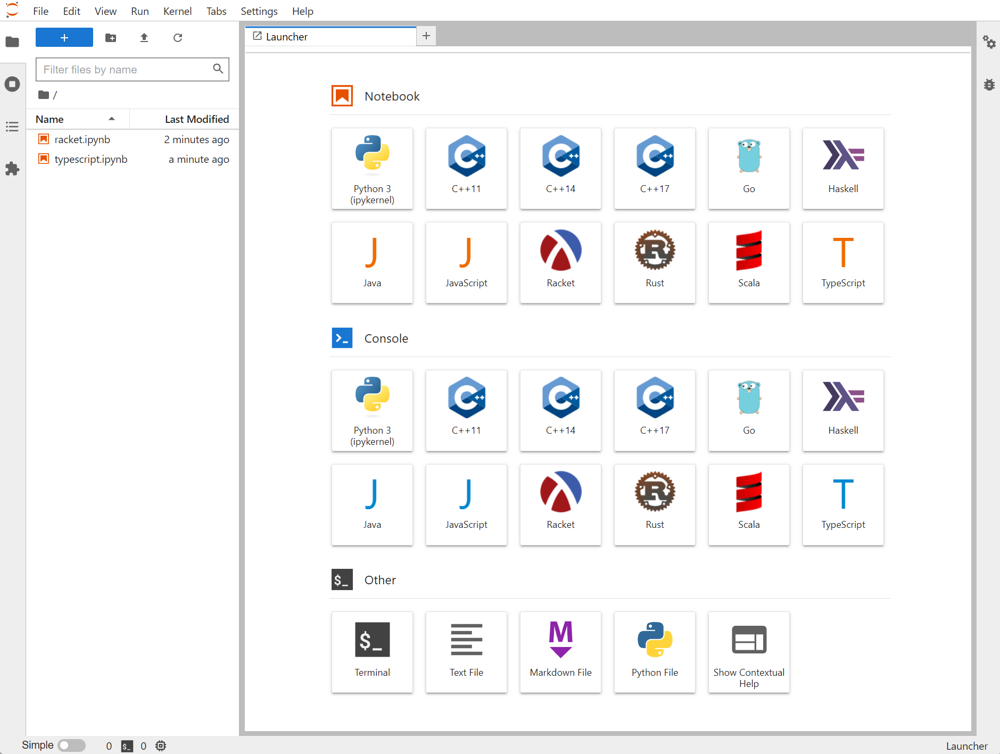
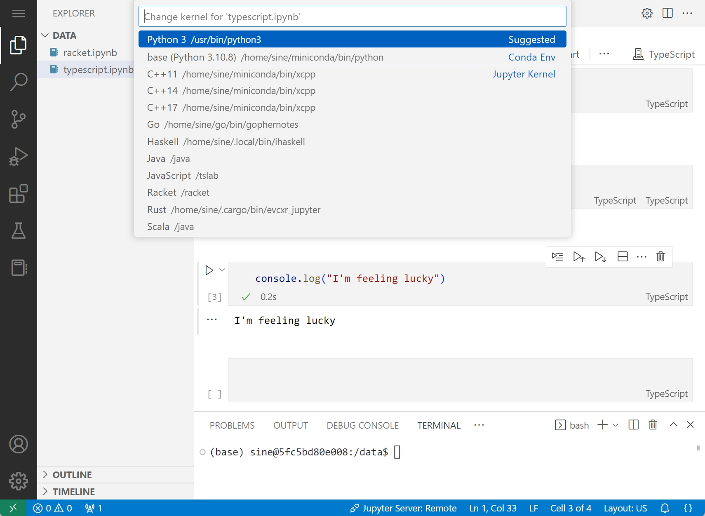

# Jupyter All-in-One

This is an Docker image of jupyter lab with multiple common language kernels included. Some use cases:

- Remote workspace for coding
- Playground of language features
- Quick validation of programming ideas
- One-off scripting

## Features

- Multiple languages are baked in:
  - Python3
  - [C++ 11, 14, 17](https://github.com/jupyter-xeus/xeus-cling)
  - [Golang](https://github.com/gopherdata/gophernotes)
  - [Haskell](https://github.com/gibiansky/IHaskell)
  - [Java](https://github.com/SpencerPark/IJava)
  - [Scala](https://github.com/almond-sh/almond)
  - [Rust](https://github.com/google/evcxr/tree/main/evcxr_jupyter)
  - [Racket](https://github.com/rmculpepper/iracket)
  - [TypeScript & JavaScript](https://github.com/yunabe/tslab)
- Both [code-server](https://github.com/coder/code-server)(VS Code) and [Jupyter Lab](https://jupyter.org/) are exposed





## Usage

```bash
docker run -d \
  -p 8080:8080 -p 8081:8081 \
  -v ~/data/lab:/data \
  -u $(id -u):$(id -g) \
  -e TOKEN=your_token \
  sineliu/jupyterlab-all-in-one:latest
```

code-server is listening on 8080, jupyter lab is listening on 8081.

Note: Rust is having issue running in code-server. [link](https://github.com/google/evcxr/issues/255)

Default user and password is `sine`. With sudo access. Build your own image for a different username.

## Miscellaneous

**Why not [jupyterwith](https://github.com/tweag/jupyterWith)?**

Nix has some limitations on flexibility:

- Installing python packages outside of nixpkgs can be troublesome
- Requires hack to make kernels compatible with code-server jupyter extension
- `/nix` is immutable, but sometimes it's convenient to edit installed packages for debugging

**Problems on uid**

As docker image delievers the filesystem, the user id and group id of installed kernels are determined at build time. There is no way to change it at runtime except for a tedious `chown`. This image is built with user id 1000 and group id 1000. Other runtime overrides are untested and may cause errors.
